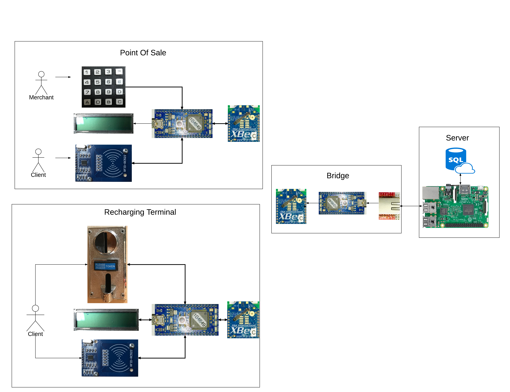
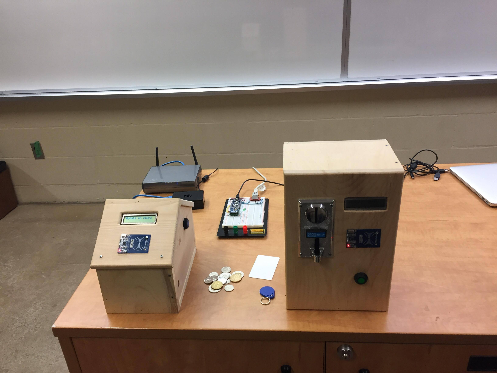
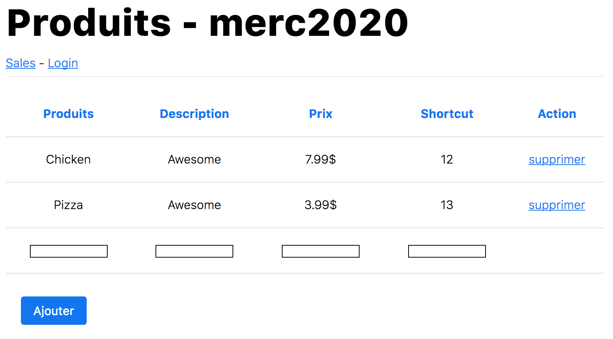

# ByPASS

## Description
This if the 5th semester project of the ByPass team at Sherbrooke University, Computer Engineering. The requirements for the project were:
 - A Zigbee network
 - Mobile nodes
 - Usage of the LPC1768 micro-controller

The team decided to design and build a payment system based on RFID cards. The goal would be to reduce the fees the various merchant at our University have to pay to accept regular credit/debit cards and to eliminate cash usage.

***Please note that some text might be in french, use google translate if you don't understand something.***

## Members
 - [Emile Fugulin](https://github.com/Sytten)
 - [Philippe Girard](https://github.com/pgirard-dev)
 - [Damien](https://github.com/dddaamien)
 - [Julien Larochelle](https://github.com/larochelle000)
 - [dostiemat](https://github.com/dostiemat)
 - [Donavan Martin](https://github.com/DonavanMartin)
 - [lechekhabs](https://github.com/lechekhabs)

## Global Architecture
The project is composed of four main parts:
 - The Node.JS [server](server) for the API and website that runs on a Raspberry PI
 - The [Point Of Sale](pos) on a LPC1768 to make payments
 - The [Recharging Terminal](recharge) on a LPC1768 to refill the accounts
 - The [bridge](bridge) on a LPC1768 to bridge the Zigbee and the Ethernet networks

 Each component is described in more details in their own folder.   

## Final product
The physical product:

The website:

