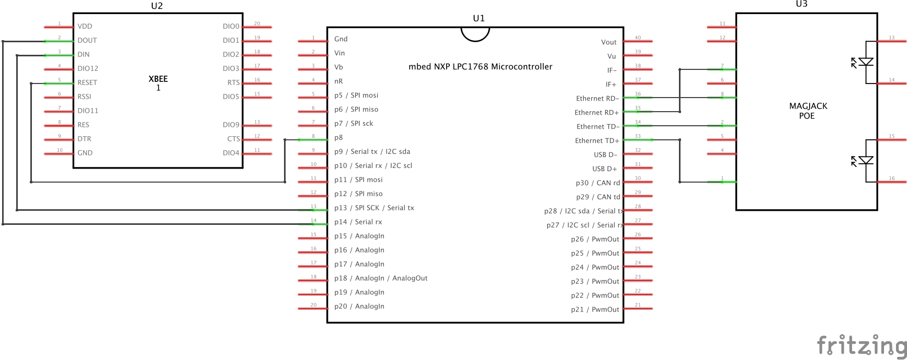

# Bridge

## Description
This is the code for the LPC1768 used as the bridge between the Zigbee and the Ethernet network.
It is designed to received requests from the various terminals via Zigbee as JSON, retransmit them to the server with a POST request and transmit the response in JSON from the server back to the terminals.

## Building
As for all C code in this project, it is highly recommended to copy the code in a new project on the (MBED compiler)[https://os.mbed.com/compiler/]. This way all the dependencies will be resolved automagically. We didn't try to build for other platforms than the LPC1768 so your mileage may vary, nor did we try to build it outside of the online IDE from (MBED)[https://www.mbed.com/en/].

## Wiring

