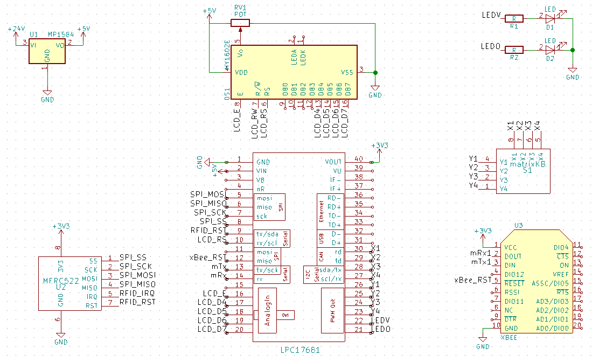

# Point Of Sale (POS)

## Description
This is the code for the LPC1768 used as the Point Of Sale (POS). We also call it the payment terminal.
When you power up the POS, the merchant must enter it's PIN. After, he can enter an order of various elements (starting with the quantity then the item number. Finally, the client uses it's RFID card to make the payment.

## Building
As for all C code in this project, it is highly recommended to copy the code in a new project on the [MBED compiler](https://os.mbed.com/compiler/). This way all the dependencies will be resolved automagically. We didn't try to build for other platforms than the LPC1768 so your mileage may vary, nor did we try to build it outside of the online IDE from [MBED](https://www.mbed.com/en/).

Also note that this projects requires some of our custom libraries that can be found in the libraries folder in the root of the current repository. Those required are listed in the lib subfolder and their names start with `ByPass-`.

## Wiring

