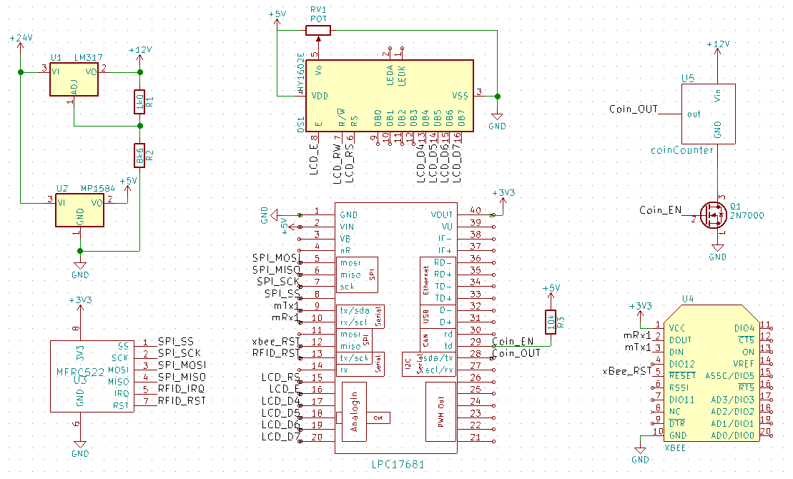

# Recharging terminal

## Description
This is the code for the LPC1768 used as the recharging terminal. This simple terminal allows a client to add money to his account or to view the balance of his account. For now only coins are accepted by the terminal.

## Building
As for all C code in this project, it is highly recommended to copy the code in a new project on the [MBED compiler](https://os.mbed.com/compiler/). This way all the dependencies will be resolved automagically. We didn't try to build for other platforms than the LPC1768 so your mileage may vary, nor did we try to build it outside of the online IDE from [MBED](https://www.mbed.com/en/).

Also note that this projects requires some of our custom libraries that can be found in the libraries folder in the root of the current repository. Those required are listed in the lib subfolder and their names start with `ByPass-`.

## Wiring

